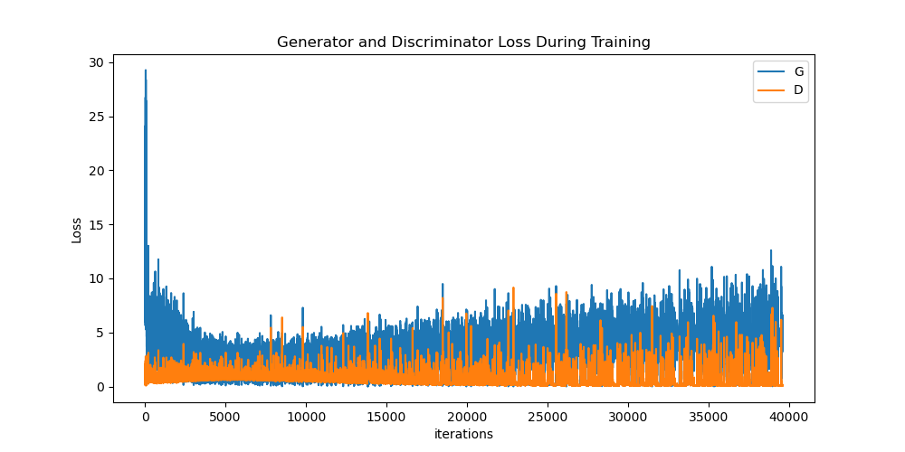
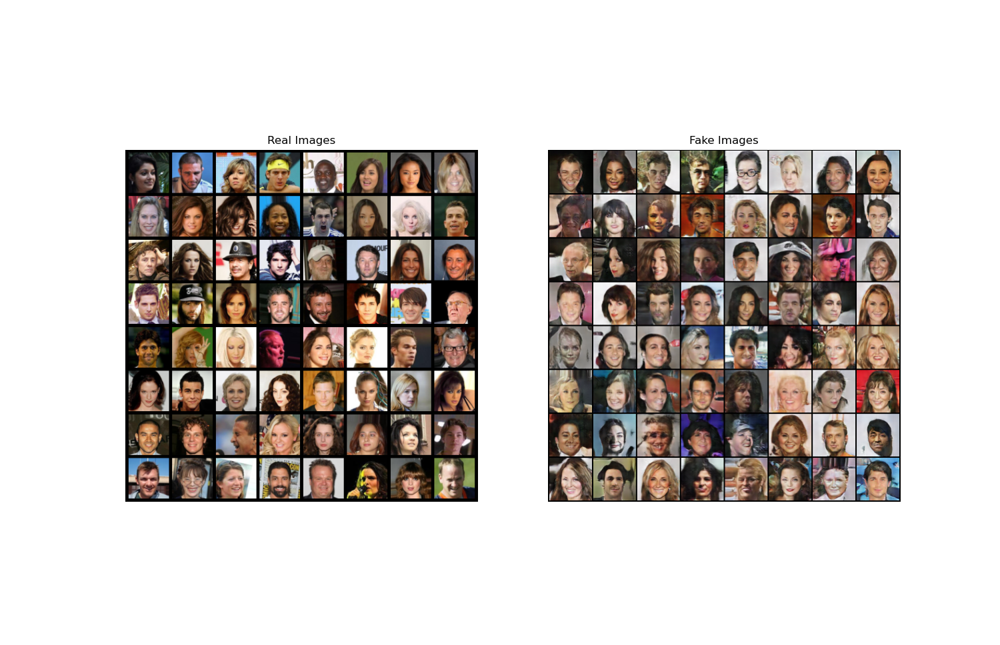
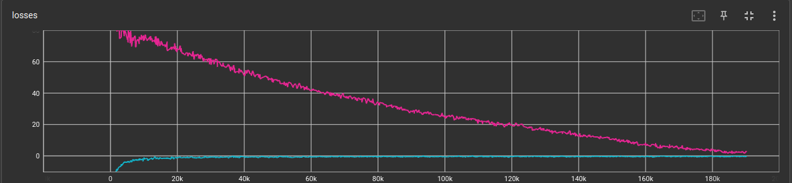
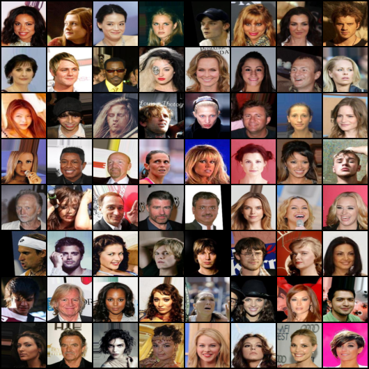
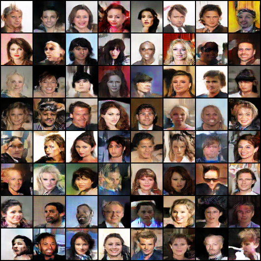
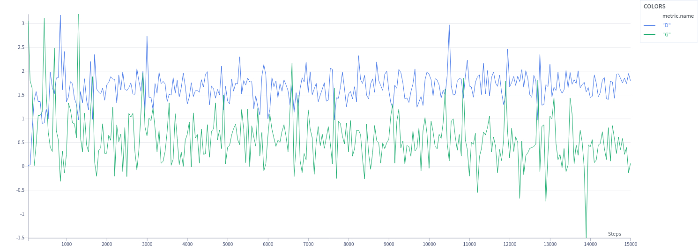
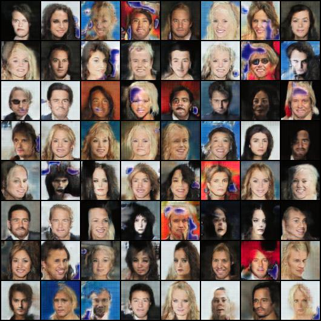

# 深度學習 作業二

## Abstract:
This project implement basic dcgan and wgan to generate human face.

## Author

洪祐鈞 a1085125

## Model link

[Model link](https://drive.google.com/drive/folders/1IUb9ye0qXdEQ16CNAZ38MDmwFbpMIrau?usp=sharing)

## How to run?

The data is not included in the repo.

run
```
python dcgan.py
python wgan.py --path data/img_align_celeba
```

For dcgan, the data path relative path should be something like ```data/img_align_celeba/```, since its staight copy of the teacher's example. (Also almost the same as pytorch documentation), the thing I add is just saving the model.

For wgan that I've implement, you can and should add the path that point to the directory of the data.
I've implemented tracking loss to tensorboard to track during the training realtime.

run
```
tensorboard --logdir logs
```
to see loss and generated per steps.

## GAN model experiment and result

Basically all model are run with about 15000 iteration, the image size is all ```64*64``` for fair comparison. Also my poor computer cannot run ```128*128``` size image since it would overflow the gpu memory.

### DCGAN

Here, the model is basically straight copy from what teacher gave us. The change I've made doesn't seemed to make any good difference. The biggest differnce happened when I modify the learning rate, or drastically increase the batch size to say, 720. The model performance significantly dropped.

#### Training

  

The training loss basically goes everywhere, and hard to tell if the model is performed well or not.

#### Animation:

  

#### Comparison:

  

### WGAN

Well, from what I've know, we want the data and generator probability distribution to be close as much as possible. The original GAN use Jensne-Shannon divergence as loss function but it was treated like binary classifcation, if the distribution is not overlap, no matter how close the distrubution is, the JS divergence would still be the same. So WGAN introduce Wasserstein distance to resolve such issue. The idea of the Wasserstein distance is to calculate what kind of the moving plan as a metric such that the generator and data distribution be the smallest. So it can actually extract more information than JS divergence even if the distribution is not overlapped. It just like a earth mover, contantly push the pile of the earth closer together.

In the paper, they changed the original Discriminator to critic, when training critic, we need to train the critic more times than the generator. At the end of the critic iteration loop, we need to do weight clipping to limit the weight 

Also WGAN take away the sigmoid layer from critic, so the critic output would not between 0 and 1.

The code implement gradient penalty as the original paper proposed weight clipping, the idea is basically sample true and fake data, the interpolation of the 2 sampled data between them should be close to 1. Also the batch normalization is changed to instance normalization layer, which would not do the normalization accross the batch.

Acually the word above is just what I've heard from [NTU-Hung-yi Lee WGAN theory intruduction](https://www.youtube.com/watch?v=jNY1WBb8l4U) and [WGAN implementation from scratch (with gradient penalty](https://www.youtube.com/watch?v=pG0QZ7OddX4), I still have no idea what was I saying. I suck at mathematics in general.

The implementation in [WGAN implementation from scratch (with gradient penalty](https://www.youtube.com/watch?v=pG0QZ7OddX4) had a error that might be fixed by me is that, we should sample new data every batch during the critics training. But the result I got doesn't matter that much.

The model architecture is the same otherwise as the dcgan.

#### Loss:



The red line is Generate loss, and blue line is Critics loss.

#### Comparison

real:

  

fake:

  

#### Animation


### LightweightGAN

Basically, I use the [repo here](https://github.com/lucidrains/lightweight-gan). As chosen paper comparison.

#### Loss



The model did implement gradient penalty and the loss is gliched like everywhere, unlike WGAN, why???

#### Result



## Conclusion

I don't really have that much of conclusion, this experiment is a total mess.
Here's some notes:
- Large batch size seems to make gan model perform worse, different from what I've read.
- For the generating result, I think DCGAN>LightweightGAN>WGAN, most of the DCGAN faces looks like faces, the face generated from Lightweight gan have some really weird blue region spot, but still can pick some good face. For the WGAN, although the training loss looks complete normal, but most of the face is really skewed.

## Final Words

The covid almost killed me that made me even hard to came up with anything or even code anything to implement what i thought, also gan model takes like forever to train. It's hard to tell any change matters or not, my hardware resource is abysmal that a lot of GAN model I run just does not work. Somehow on kaggle, even with 2 GPU, It somehow even run slower than 3050 4gb laptop gpu (I had bottleneck using kaggle cpu), and it disconnect every 12 hrs. 

I have mass frustration doing this project. As Hung-yi Lee professor in NTU said: "No pain, no GAN".